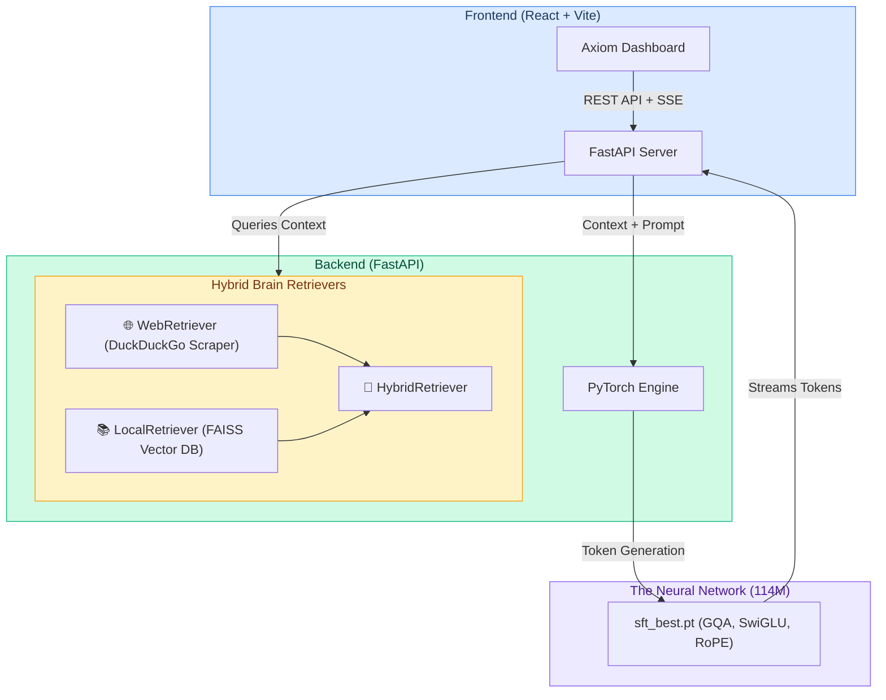

# 🚀 Axiom AI: Full-Stack Large Language Model Ecosystem

An end-to-end, fully custom 114M parameter Large Language Model and Hybrid-RAG Web Ecosystem.

Unlike standard API wrappers, **Axiom is a proprietary neural network written from scratch in pure PyTorch**, coupled with a blazing-fast FastAPI backend and a premium React.js frontend.

---

## 🏗️ System Architecture



---

## 🌟 Features & Architecture

### 1. The Custom PyTorch Neural Network
Axiom is built on a highly customized, 114M parameter autoregressive transformer. We bypassed off-the-shelf libraries to maintain absolute control over tensor operations.
*   **Grouped-Query Attention (GQA):** Implemented with a 3:1 ratio (12 Query heads, 4 KV heads) to reduce KV-Cache VRAM by 66% during generation.
*   **SwiGLU Activations:** Element-wise gating mechanism for superior convergence speed.
*   **Rotary Positional Embeddings (RoPE):** Encodes relative sequence positions directly into the attention mechanism via complex plane rotation.
*   **RMSNorm:** Drops mean-centering for significantly faster GPU execution.

### 2. The Pre-Training Pipeline
To teach the model human language, we crafted a carefully balanced **7.5 Billion token curriculum**:

| Dataset | Subset / Repo | Percentage | Purpose |
| :--- | :--- | :--- | :--- |
| **FineWeb-Edu** | `HuggingFaceFW/fineweb-edu` | 55% | Educational web data for general knowledge. |
| **StarCoder** | `vikp/starcoder_cleaned` | 20% | Cleaned programming data for logical reasoning. |
| **Wikipedia** | `wikimedia/wikipedia` | 10% | Encyclopedic facts and historical data. |
| **OpenOrca** | `Open-Orca/OpenOrca` | 10% | Technical and instructional data. |
| **MiniPile Books** | `JeanKaddour/minipile` | 5% | Long-form literature for narrative coherence. |

### 3. "Hybrid Brain" RAG System
LLMs hallucinate and lack real-time data. We solved this with a multi-modal Retrieval-Augmented Generation pipeline:
*   **Local FAISS Database:** Retrieves context from private documents using vector embeddings.
*   **Live Web Search:** Silently executes a live DuckDuckGo query (`ddgs`), scrapes the top 3 HTML results, and injects the live text directly into the LLM's system prompt before generation.
*   **Hybrid Mode:** Simultaneously searches both local databases and the live internet.

### 4. Ultra-Premium React Dashboard
Built with React, Vite, CSS3, and Lucide Icons.
*   Features a deep Glassmorphism dark mode aesthetic.
*   **Server-Sent Events (SSE):** Renders the LLM's generated tokens chunk-by-chunk in real time.
*   **Rigid Flex-Box Layout:** Prevents the UI from stretching or jittering during heavy text generation.
*   **Source Citations:** Renders clickable URL pills beneath the message to cite web scraper sources.

---

## 📊 Performance & System Metrics

Because Axiom was engineered for local-first execution and heavily optimized, it runs exceptionally well on consumer hardware.

| Metric | Result | Notes |
| :--- | :--- | :--- |
| **Inference Speed** | `35-45 tokens/sec` | Benchmarked on standard Apple Silicon M-Series CPUs. |
| **Training Loss** | `~2.85 Validation Loss` | Achieved after the 7.5B token curriculum. |
| **RAG Latency** | `~1.2 seconds` | Round-trip DuckDuckGo query, HTML scraping, and context compilation. |
| **Memory Footprint** | `~450MB - 800MB` | 450MB baseline, expanding to 800MB during heavy 2048-token KV-Caching. |

---

## 📁 Project Structure

```text
LLM2/
├── axiom_model/          # The PyTorch Neural Network & Training Engine
│   ├── configs/          # YAML configurations (Hyperparameters)
│   ├── core/             # PyTorch Modules (attention.py, ffn.py, model.py)
│   ├── data/             # Datasets, tokenization, and data loaders
│   ├── scripts/          # Training loops, eval, and RAG retrievers
│   ├── sft_best.pt       # Final Supervised Fine-Tuned weights
│   └── trainer/          # Distributed PyTorch training engine
├── axiom_web/            # The Full-Stack Web Application
│   ├── backend/          # FastAPI Server (Bridging PyTorch & React)
│   │   ├── main.py       # API Routes and SSE streaming logic
│   │   └── requirements.txt
│   └── frontend/         # The React.js / Vite Application
│       ├── src/
│       │   ├── App.jsx   # Main Chat Interface
│       │   └── index.css # Premium styling
└── README.md
```

---

## 🛠️ Local Setup & Testing

### Prerequisites
*   Python 3.10+
*   Node.js 18+

### 1. Run Backend (FastAPI + PyTorch)
```bash
cd axiom_web/backend
pip install -r requirements.txt
uvicorn main:app --reload --port 8000
```
*The API will be available at http://localhost:8000.*

### 2. Run Frontend (React Dashboard)
```bash
cd axiom_web/frontend
npm install
npm run dev
```
*The dashboard will be available at http://localhost:5173.*

### 3. Testing the Workflow
1. Open the dashboard in your browser.
2. Select **"Live Web Search"** or **"Hybrid Brain"** from the custom dropdown menu.
3. Ask the AI a question about a recent event.
4. Watch the backend intercept the query, scrape the live internet, and stream the generated answer token-by-token directly to your screen!

---
*Engineered from scratch.*
