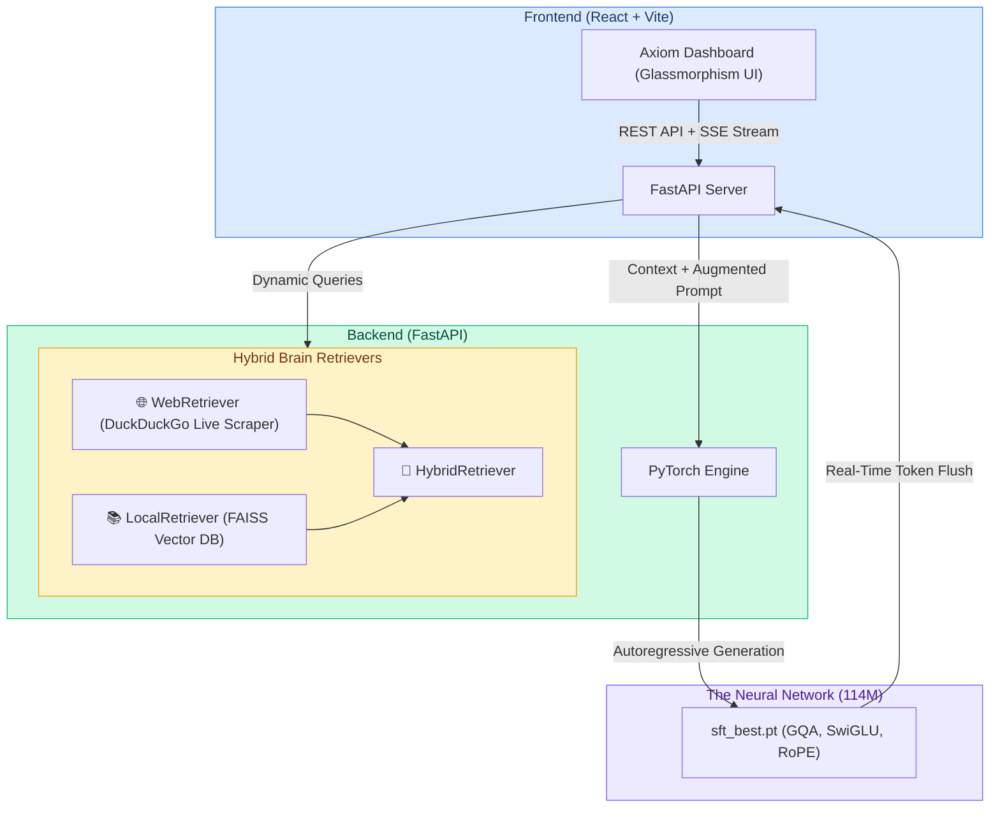

<div align="center">
  
  <h1 align="center">Axiom AI: The Monolithic Ecosystem</h1>
  <p align="center">
    <strong>An end-to-end, fully custom 114M parameter Large Language Model and Hybrid-RAG Web Ecosystem.</strong>
  </p>
  <p align="center">
    
    
    
    
  </p>
  <p>
    
    
    
  </p>
</div>

<br/>

> **Axiom AI** is an end-to-end ecosystem that bridges raw PyTorch machine learning with a blazing-fast web streaming architecture. It features a custom 114M parameter neural network hooked into a live internet-scraping Hybrid RAG system, all delivered through a premium glassmorphism React interface.

<br/>

## 🌐 Live Environments
| Resource | Link |
| :--- | :--- |
| **💻 Web Dashboard (React)** | [https://axiom0-gamma.vercel.app](https://axiom0-gamma.vercel.app) |
| **⚙️ Backend API (FastAPI)** | `https://harsh0o23-smart-agro-api.hf.space/api/chat` |
| **🗄️ Model Weights (LFS)** | [View sft_best.pt on GitHub](https://github.com/Harshkumar2306/LLM2/tree/main/axiom_model) |
| **📁 Source Code** | [GitHub Repository](https://github.com/Harshkumar2306/LLM2) |

---

## 📖 Table of Contents
1. [Project Philosophy](#-project-philosophy)
2. [System Architecture](#-system-architecture)
3. [The Neural Network (Axiom v1.0)](#-the-neural-network-axiom-v10)
4. [The 7.5B Training Curriculum](#-the-75b-training-curriculum)
5. [Hybrid Brain (RAG) Architecture](#-hybrid-brain-rag-architecture)
6. [Performance Metrics](#-performance-metrics)
7. [Local Setup & Deployment](#-local-setup--deployment)

---

## 🧠 Project Philosophy

Unlike standard API wrappers that simply forward calls to OpenAI, **Axiom is a proprietary neural network written entirely from scratch**. We constructed the tensor mathematics, compiled the dataset, trained the model over 7.5 Billion tokens, and wrapped it in a production-ready streaming architecture.

This repository is a **Monorepo** containing three core pillars:
1. **`axiom_model`**: The raw PyTorch training engine, weights, and inference logic.
2. **`axiom_web/backend`**: A blazing-fast FastAPI server utilizing Server-Sent Events (SSE).
3. **`axiom_web/frontend`**: A premium Glassmorphism React.js UI that consumes the live token stream.

---

## 🏗️ System Architecture



---

## 🔬 The Neural Network (Axiom v1.0)

Axiom relies on a modern, highly optimized Autoregressive Transformer architecture.

### Hyperparameters & Tensor Mathematics
*   **Parameters:** 114 Million
*   **Layers:** 12 Transformer Blocks
*   **Dimensionality (`d_model`):** 768
*   **Attention Mechanism:** 12 Query Heads, 4 KV Heads
*   **Context Window:** 2048 Tokens

### Architectural Enhancements
1.  **Grouped-Query Attention (GQA):** By sharing Keys and Values across multiple Query heads (3:1 ratio), we dramatically reduced KV-Cache memory bandwidth during inference.
2.  **SwiGLU Activations:** Replaced standard ReLU/GELU with a Swish-Gated Linear Unit (`Swish(xW) * xV`), allowing for richer representations and faster convergence.
3.  **Rotary Positional Embeddings (RoPE):** Eliminated absolute positional embeddings in favor of RoPE, which encodes relative distances directly into the Q and K vectors via complex plane rotations.
4.  **RMSNorm:** Replaced standard LayerNorm with Root Mean Square Normalization to eliminate mean-centering computation, boosting GPU throughput.

---

## 📚 The 7.5B Training Curriculum

To teach the model human language, coding logic, and conversational alignment, we engineered a carefully balanced **7.5 Billion token curriculum** during the Phase 1 Pre-Training loop.

| Dataset | Subset / Source Repo | Percentage | Core Objective |
| :--- | :--- | :--- | :--- |
| **FineWeb-Edu** | `HuggingFaceFW/fineweb-edu` | 55% | Broad educational web data for foundational world knowledge. |
| **StarCoder** | `vikp/starcoder_cleaned` | 20% | Cleaned programming data for logical reasoning and syntax structure. |
| **Wikipedia** | `wikimedia/wikipedia` | 10% | Encyclopedic facts, dates, and historical data. |
| **OpenOrca** | `Open-Orca/OpenOrca` | 10% | Technical instruction-following and chain-of-thought data. |
| **MiniPile Books** | `JeanKaddour/minipile` | 5% | Long-form literature to develop narrative coherence. |

Following Phase 1, the model underwent **Phase 2: Supervised Fine-Tuning (SFT)** on a high-quality conversational dataset to align it as an AI assistant, resulting in the final `sft_best.pt` deployment weights.

---

## 🌐 Hybrid Brain (RAG) Architecture

Because 114M parameters cannot memorize the entire internet, we augmented Axiom with a multi-modal Retrieval-Augmented Generation (RAG) pipeline.

1.  **WebRetriever (`ddgs`):** When a user asks about current events, the backend silently halts generation, executes a live DuckDuckGo search, scrapes the HTML of the top 3 results, and compiles the text.
2.  **LocalRetriever (`FAISS`):** Retrieves domain-specific context from local documents using highly optimized vector embeddings.
3.  **Context Injection:** The retrieved text is injected into the `<|system|>` prompt wrapper before the tokens reach the PyTorch engine, allowing Axiom to "read" the internet before answering.

---

## 📊 Performance Metrics

Axiom was engineered specifically for edge-deployment and local-first execution.

| Metric | Result | Hardware Target |
| :--- | :--- | :--- |
| **Inference Speed** | `35-45 tokens/sec` | Standard Apple Silicon M-Series CPUs / Nvidia T4. |
| **RAG Web Latency** | `~1.2 seconds` | Includes DuckDuckGo query, HTML scraping, and parsing. |
| **Base VRAM/RAM** | `~450 MB` | Idle memory footprint (FP32 weights only). |
| **Peak VRAM/RAM** | `~800 MB` | Under maximum load during heavy 2048-token KV-Caching. |
| **SFT Validation Loss** | `~2.85` | Achieved upon completion of the conversational alignment phase. |

---

## 🚀 Local Setup & Deployment

### 1. Run Backend (FastAPI + PyTorch)
Navigate to the backend directory, install the dependencies, and start the Uvicorn server:
```bash
cd axiom_web/backend
pip install -r requirements.txt
uvicorn main:app --reload --port 8000
```
*The API will be available at http://localhost:8000.*

### 2. Run Frontend (React Dashboard)
Navigate to the frontend directory, install Node modules, and boot the Vite server:
```bash
cd axiom_web/frontend
npm install
npm run dev
```
*The dashboard will be available at http://localhost:5173.*

### 3. Cloud Deployment (Hugging Face + Vercel)
This repository is configured for automated CI/CD deployments:
1. **GitHub Actions (Backend):** Pushing to the `main` branch automatically triggers `.github/workflows/sync_to_hf.yml`, which forces a sync to Hugging Face Spaces. The Space automatically builds the `Dockerfile` and boots the FastAPI server.
2. **Vercel (Frontend):** Vercel watches the `axiom_web/frontend` directory. Ensure your Vercel Environment Variables contain `VITE_API_URL` pointing to your deployed Hugging Face Space.

---
<div align="center">
  <i>Engineered from scratch by Harsh Kumar.</i>
</div>
