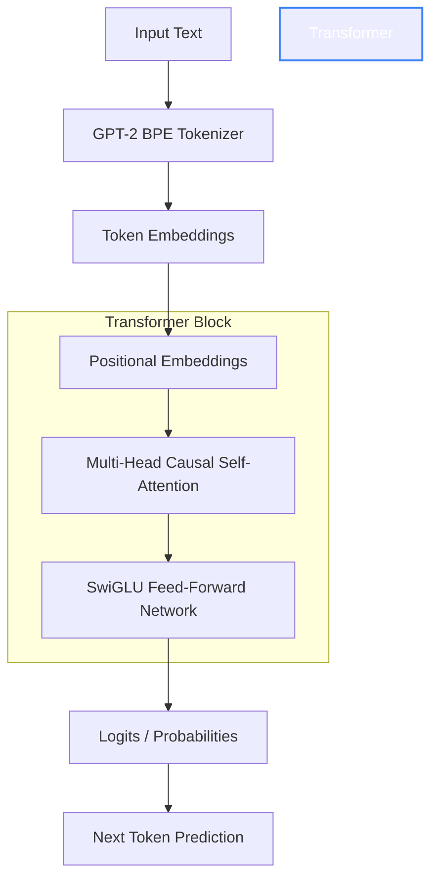

# 🧠 Axiom Core V2: Multi-GPU PyTorch LLM (26.7M Parameters)


A comprehensive, end-to-end framework for building, training, and evaluating a Large Language Model (LLM) completely from scratch. 

This repository contains the mathematical implementation of **Axiom V2**, a custom generative AI built on a modern Decoder-Only Transformer architecture. Scaled up to **26.7 Million parameters**, this version utilizes PyTorch `DataParallel` and memory-mapping for massive 2GB dataset training on dual-GPU environments like Kaggle T4x2.

The frontend and backend deployment stack for this model can be found in the sister repository: [Axiom Deployment](https://github.com/Harshkumar2306/Axiom).

**🔥 Live Demo:**
* 🌐 **Frontend (Chat UI):** [https://axiom-sable-six.vercel.app/](https://axiom-sable-six.vercel.app/)
* ⚙️ **Backend API:** `https://axiom-zov1.onrender.com/generate`

**📄 Read the Full Technical Whitepaper:** [REPORT.md](./REPORT.md)

---

## 🏗️ The Architecture (26.7M Parameters)



We didn't just build a basic neural network; we built a modern **Decoder-Only Transformer** mirroring the foundational architecture of industry-leading models like GPT-4 and Llama 3, scaled to **26.7 Million parameters** for multi-GPU training.

### 1. Tokenization (GPT-2 BPE)
Before feeding text into the network, we encode it using the GPT-2 Byte-Pair Encoding (BPE) tokenizer. This allows the AI to perfectly understand sub-words and syllables while keeping its vocabulary strictly limited to exactly **50,257** tokens.

### 2. Multi-Head Causal Self-Attention
The core engine. The model uses 8 parallel attention heads to mathematically "look" at surrounding words to gather deep context. We apply a **Causal Mask** to force the AI to only look at past tokens, training it strictly as an autoregressive next-token predictor.

### 3. SwiGLU Activation Function
Older models rely on `ReLU` or `GELU` for feed-forward activation. Axiom is upgraded with **SwiGLU** (Swish-Gated Linear Unit)—the exact same bleeding-edge mathematical activation function used by Meta's **Llama 3**. SwiGLU splits the data stream, applying a non-linear gate to one side, which allows the neural network to learn much richer, more nuanced representations of the English language without needing to add millions of extra parameters.

### 4. Positional Memory
Since Transformers process all words simultaneously rather than left-to-right, we inject physical location data directly into the mathematical embeddings of every token so the model possesses a strict sense of time and word order.

---

## 🔬 The Training Methodology

The model was trained on the `TinyShakespeare` dataset (a 1MB text file containing the compiled works of William Shakespeare). 

1. **Random Batching:** A custom Data Loader grabs random sequences of 1,024 tokens and feeds them in parallel batches to the GPU to drastically accelerate training.
2. **Cross-Entropy Loss:** The model predicts a sequence, and we use Cross-Entropy Loss to mathematically calculate exactly how wrong its predictions were compared to the actual Shakespeare script.
3. **AdamW Optimizer & Backpropagation:** We use the `AdamW` optimizer (with gradient clipping to prevent exploding math) to tweak the values of all **26.7 million** parameters in the exact opposite direction of the error.
4. **Validation Checkpointing (90/10 Split):** To ensure the model learns English structure rather than just memorizing the script, we test it on a 10% held-out validation set. The `engine` automatically saves a `best.pt` file every time the model achieves a new high score on the unseen validation data.

After 10,000 iterations, the randomized math settles, and the model masters the statistical patterns, rhythm, and vocabulary of William Shakespeare.

---

## 📂 Repository Structure

The repository has been professionally structured for scalability and cleanliness:

```text
LLM/
├── core/              # The PyTorch Architecture (model, attention, ffn)
├── data/              # The Dataset & Tokenizer scripts
├── engine/            # The Training Loop (trainer.py)
├── scripts/           # Execution Scripts (train, evaluate, generate)
├── utils/             # Helper functions and metrics
├── config/            # Hyperparameter configs (train_config.yaml)
├── colab_train.ipynb  # 1-Click Cloud Training Notebook
└── requirements.txt   # Python dependencies
```

---

## 💻 Usage & Reproduction

To train this exact model locally or on a cloud GPU (AWS, RunPod, Google Colab):

### 1. Setup & Data Preparation
```bash
git clone https://github.com/Harshkumar2306/LLM.git
cd LLM
pip install -r requirements.txt

# Download and tokenize the TinyShakespeare dataset
python scripts/prepare_data.py --input data/input.txt --outdir data/
```

### 2. Multi-GPU Training (DataParallel)
The training loop utilizes `torch.nn.DataParallel` and `np.memmap` to handle 2GB datasets across multiple GPUs.
```bash
python scripts/train.py \
    --train_bin data/train.bin \
    --val_bin data/val.bin \
    --device cuda \
    --batch_size 16 \
    --grad_accum_steps 4 \
    --d_model 384 \
    --n_heads 12 \
    --n_layers 4 \
    --out_dir runs/axiom_v2
```

### 3. Text Generation
Test the model's predictive capabilities by feeding it a prompt.
```bash
python scripts/generate.py \
    --checkpoint runs/axiom_v1/best.pt \
    --prompt "ROMEO:" \
    --device cuda
```

---
*Developed with ❤️ as a deep dive into Large Language Model Architectures.*
